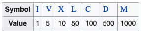

# Ejercicio2

En este ejercicio, voy a establecer lo entendido del planteamiento puesto que al no recibir respuesta sobre mi duda comenzaré a emplear lo que considero que es la problemática.

En particular entiendo que el problema trata de calcular la cantidad de años entre un periodo A y B y con esto buscar la conversión a números romanos, todo esto para determinar la cantidad de símbolos que se necesitan para almacenar dicha fecha en un DB.

En este caso es importante conocer bastante bien el esquema de números romanos, la cantidad de símbolos que manejan y su interpretación o traducción a nuestro sistema decimal. Para ejemplificar esto tenemos una tabla que nos ayuda a entender la simbología:



fuente: https://en.wikipedia.org/wiki/Roman_numerals

como podemos observar el sistema tiene una base 10, esto quiere decir que cada que nuestra cifra sube 10 veces tenemos un nuevo símbolo, además queda decir que cada símbolo no se puede repetir más de 3 veces ( exceptuando algunos casos específicos ).

Ahora bien, sabiendo estos datos procedemos a realizar una solución puesto que en pocas palabras lo que necesitamos es encontrar la cantidad de símbolos romanos que utiliza un número n. si sabemos que tienen una base 10, es decir, cada 10 veces un dato cambia el símbolo, podemos comenzar pensando en descomponer estos números con esta base:

    -> n/x: n = número por convertir, x = la primera base en que se puede descomponer.

y sabiendo que existen una limitada cantidad de símbolos sólo necesitamos alojar los valores de estos símbolos para calcular sus bases, una vez calculadas irlos agregando a un contador para conocer la cantidad necesaria de símbolos para un número n.

## Implementacion
Despues de una previa instalacion de Python en el PC donde se utilice el programa, procedemos a abrir un shell y dentro de la carpeta donde está el modulo main.py, escribimos:

```
    python main.py
```

por ultimo queda utilizar el programa como se indica dentro del mismo.